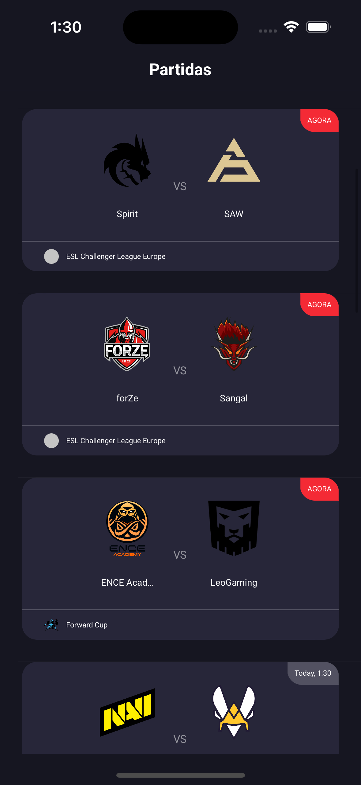
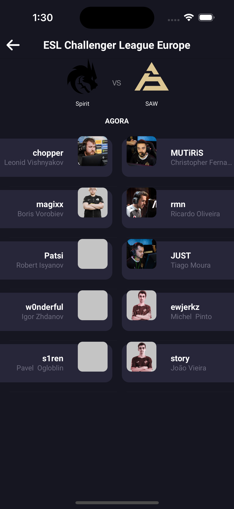
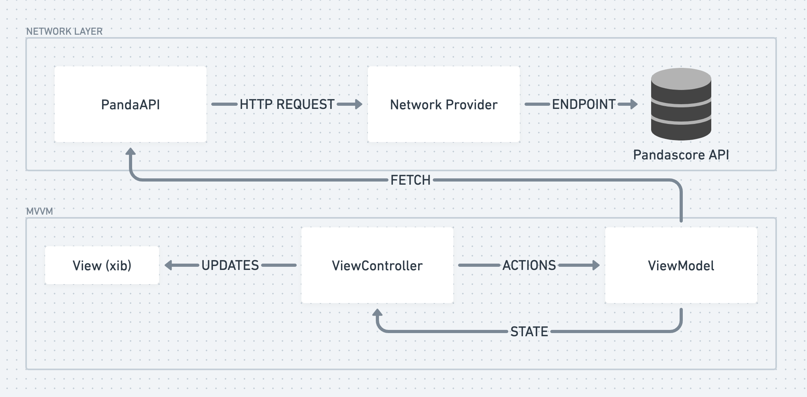

#Fuse Challenge: Counter Strike Match Tracker

This iOS project allows users to view the latest Counter Strike matches from the Pandascore API. With this app, you can easily keep track of your favorite teams and players, and never miss a match again.

| Matches     | Match Details |
| ----------- | ----------- |
|       |         |


## Features

- View the latest Counter Strike matches
- See detailed information about each match, including time, teams and players

## Requirements

- Xcode 14.1
- iOS 16.1 or later

## Installation

To install the app, follow these steps:

1. Open the file `FuseCodeChallenge.xcodeproj` in Xcode 
2. If you are running on Simulator, just press run `CMD+R`
3. If you are running on a real device, you must update the team information for a team where your device is registred

## Usage

To use the app, follow these steps:

1. Open the app on your iOS device
2. Scroll through the list of available matches to find the one you want to view
3. Tap on a match to see detailed information about it

## MVVM iOS Archicture

The Test Project is built using the Model-View-ViewModel (MVVM) architecture. The MVVM pattern is a variation of the traditional Model-View-Controller (MVC) pattern, with the key difference being the introduction of a new component called the ViewModel.

The ViewModel is responsible for managing the data and state of the app, and providing it to the View in a format that is easy to use. It communicates with the Pandascore data API through a Network Provider class, which handles all network requests such as fetching matches and details of the teams from a remote server using a REST API.

The MVVM architecture provides a clean, modular design for our app. It allows us to separate the concerns of the user interface, data management, and network communication, making the code easier to maintain and develop. It also allows different components of the app to be tested and modified independently.



## State Handlers

In our architecture, the ViewModel is responsible for managing the data and state of the screen and can provide different states to the View, such as `loading`, `error`, and `ready`.

When the screen is first loaded, the ViewModel might provide a `loading` state to the View to indicate that it is currently fetching data from the Network Provide API. This could be displayed to the user as a loading indicator, to let them know that the screen is working and they should wait for it to finish loading.

If an error occurs while fetching the data, the ViewModel might provide an `error` state to the View with an error message. This could be displayed to the user as an error message, to let them know that something went wrong and they may need to try again.

Once the data has been successfully fetched, the ViewModel can provide a `ready` state to the View. This indicates that the data is ready to be displayed to the user. The View can then use this data to populate the user interface and make it ready for user interaction.

The ViewModel provides a Combine state publisher and the Viewcontroller subscribes to that publisher, for example:
```
func bind() {
    self.viewModel.statePublisher
      .receive(on: RunLoop.main)
      .sink { [weak self] state in
        guard let self = self else { return }
        self.handleState(state: state)
      }
      .store(in: &cancellables)
  }

  private func handleState(state: HomeState) {
    switch state {
    case .loading: loadingState()
    case .error(let errorMsg): handleError(msg: errorMsg)
    case .ready: readyState()
    }
  }
  ```

In summary, the ViewModel provides different states to the View to keep it informed about the current state of the screen. This allows the View to display appropriate messages and indicators to the user, and ensures that they have a smooth and seamless experience while using the app.

## Network Provider

The Network Provider is a generic class that can be used to fetch data from a remote API server. It provides a convenient interface for making network requests and handling the codable responses, without having to deal with the details of network communication directly.

To use the network provider, you simply need to provide an instance of class/struct fulfilling the `URLRequestProtocol` that defines how the API endpoint should be created, including things like the http method, params, body, headers, etc. The Network Provider will take care of the rest. It will send a request to the API server and handle the response, providing the `Codable` data to you in a convenient format.

the network provider and the `URLRequestProtocol` supports a wide range of HTTP methods, including GET, POST, PUT, and DELETE. It also allows you to specify query parameters, headers, and request body data, as needed.

Additionally, the Network Provider has built-in support for handling common network errors, such as timeouts and connectivity issues. It uses the newest `async/await` features to avoid completion blocks and result return types.

Here is an example of how we use the Network Provide to fetch the games from the Pandascore API:
```
func fetchGames(page: Int = 1) async throws -> [PandascoreMatch] {
    let matchesEndpoint = self.host + "matches"

    let dateFormatter = DateFormatter()
    dateFormatter.dateFormat = "yyyy-MM-dd"
    let todayString = dateFormatter.string(from: Date())

    let urlParams = [
      URLQueryItem(name: "sort", value: "-status,begin_at"),
      URLQueryItem(name: "page", value: "\(page)"),
      URLQueryItem(name: "per_page", value: "50"),
      URLQueryItem(name: "range[begin_at]", value: "\(todayString),2122-12-31")
    ]
    
    let endpoint = PandascoreEndpoint(url: matchesEndpoint, urlParameters: urlParams)

    return try await networkProvider.fetch(endpoint: endpoint, shouldClearCache: false)
  }
  ```

In summary, our network provider is a versatile and easy-to-use class for fetching data from a remote API server. It simplifies the process of making network requests and handling Codable responses in a generic way, allowing you to focus on your app's logic and user experience.

## RemoteImage and Cache

The RemoteImage class is a simple and convenient way to fetch images from the internet and display them in the app. It uses the `async/await` pattern to asynchronously fetch images from a remote URL, ensuring that the app's main thread remains responsive and smooth.

To use the RemoteImage class, you simply need to provide the URL of the image that you want to fetch. The class will take care of the rest, sending a request to the server and asynchronously downloading the image data.

The RemoteImage class uses a NSCache object to avoid downloading the same image more than once. If you attempt to fetch an image from the same URL multiple times, the class will check the cache to see if it already has the UIImage data available. If so, it will simply return the cached UIImage data, rather than sending a new request to the server. This can help to improve the performance of your app, by avoiding unnecessary network requests.

In summary, the RemoteImage class is a simple and efficient way to asynchronously fetch and display images from the internet. It uses the async/await pattern to ensure that the app's main thread remains responsive, and uses a NSCache object to avoid downloading the same image more than once. 

## Unit Tests

Most of the ViewModels in the project have a Unit Test and also some important extensions and other classes in the project.

## What would I differently if I had more time?
1. Create some UI components for reuse
2. Stub API responses for better Unit Testing
3. Add Snapshot tests to validate the UI
4. Add support to empty states for both Matches and players list
5. Write Unit Tests for the RemoteImage class
6. Handle the empty states for both Matches and Details screens.